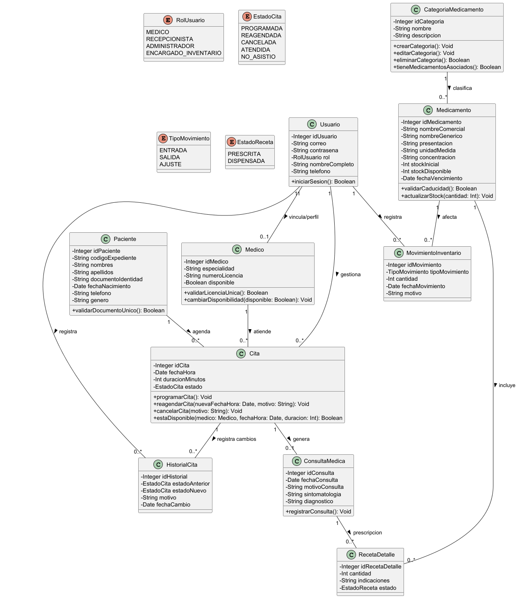

# MediClinic Care

## Descripción

El sistema esta enfocado en simplificar y automatizar los procesos clave del día a día;la agenda de citas medicas, el registro básico de pacientes y el control de consultas

## Diagrama de clases



## Diagrama de tablas


## Ejecución

```bash
# Compilar
./mvnw compile

# Ejecutar (requiere application-local.properties con credenciales de SQL Server)
./mvnw spring-boot:run -Dspring-boot.run.profiles=local

# Ejecutar tests
./mvnw test
```

## Configuración

Las credenciales de la base de datos están en `src/main/resources/application-local.properties` (gitignored).
