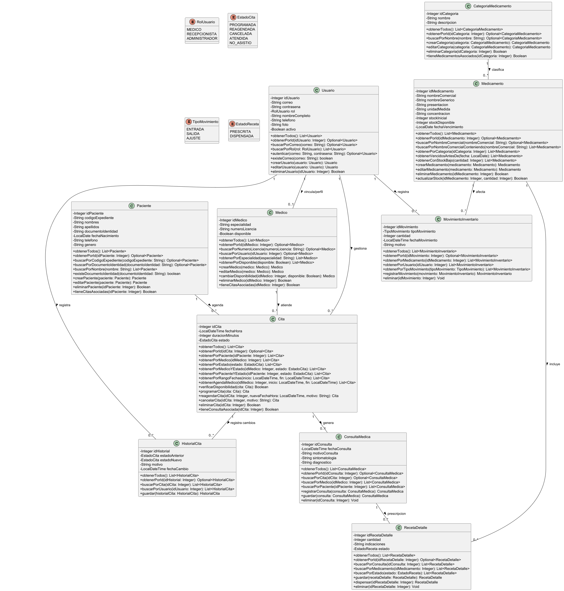
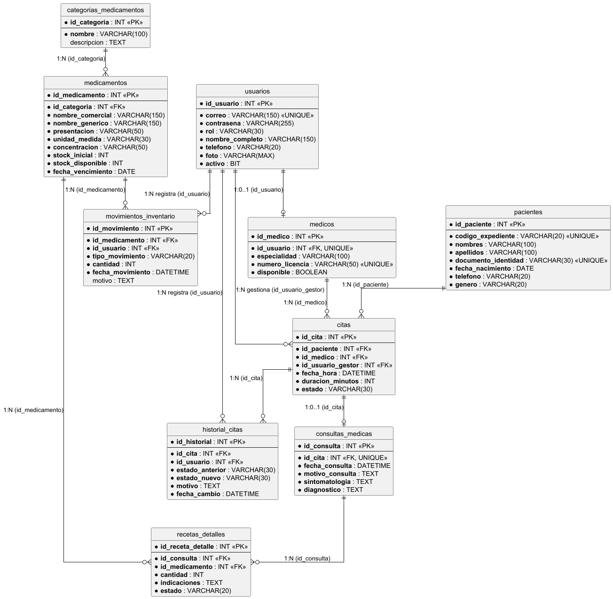

# MediClinic Care

## Descripción

El sistema esta enfocado en simplificar y automatizar los procesos clave del día a día;la agenda de citas medicas, el registro básico de pacientes y el control de consultas

## Diagrama de clases



## Diagrama de tablas



## Ejecución

```bash
# Compilar
./mvnw compile

# Ejecutar (con profile local — usa credenciales de application-local.properties)
./mvnw spring-boot:run "-Dspring-boot.run.profiles=local"

# Ejecutar (sin profile — usa valores por defecto de application.properties)
./mvnw spring-boot:run

# Ejecutar tests
./mvnw test
```

La aplicación abre en **http://localhost:8081**

## Configuración

- Las credenciales de la base de datos están en `src/main/resources/application-local.properties` (gitignored).
- Sin el profile `local`, se usan los valores por defecto definidos en `application.properties` (`mediclinic_app` / `Med1cl1nic!2024`).
